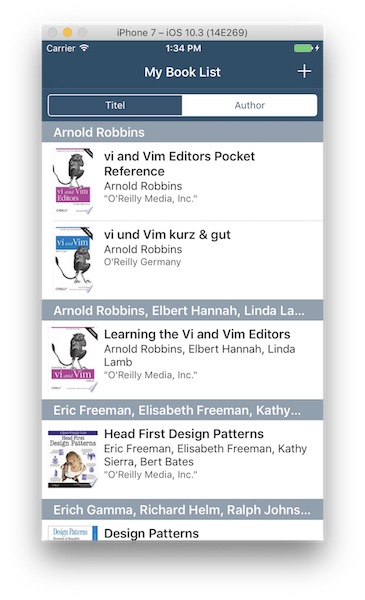
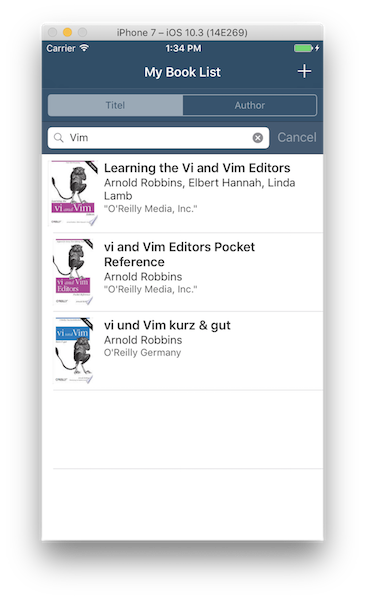
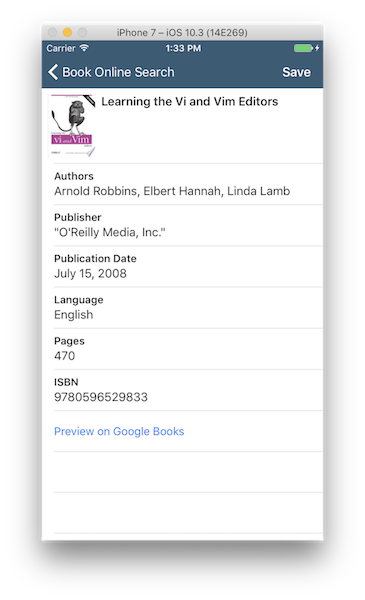

# udacity-ios-FinalProject

This is my final project for the Udacity "iOS Developer Nanodegree" Program:

https://www.udacity.com/course/ios-developer-nanodegree--nd003

# Table of Contents
* [App Description](#description) 
* [Project Details](#projectdetails) 
* [User Interface](#ui) 
* [App Demo](#demo) 
* [Feature Wishlist](#features) 
* [App Requirements](#appreq)

<a name="description">

## App Description

This app allows users to add books to their own book list via an online book search (Google Books API). The user can search 
e.g. for a book title, an author or an ISBN. Once the search results are displayed in a table view, the user user can select 
a book to open a detail view of this book. In the detail view the book can be saved and will be added to the book list. 

Furthermore a preview of the book can be openend in Safari by clicking on the "Preview on Google Books" Button in the detail 
view of the book.

All added books are diplayed in the book list view. The books can be sorted by Title or Author. Selecting an added book will 
open a detail view of this book as well. Additionally the book can be shared e.g. via iMessage by clicking the "Share" Button. 

By swiping down the book list, a search bar is revealed. The user can search in their own book list for title, author, 
publisher or ISBN to easily find a specific book.

A book can be delted from the own book list by swiping left on the book cell.

<a name="projectdetails">

## Project Details

### User Interface

* Three main View Controllers:
  - Book List View Controller
  - Book Search View Controller
  - Book Detail View Controller
* All three main View Controllers are using a Table View
* Book Search is presented modally
* Book List and Book Search are embedded in a Navigation View Controller to display Book Detail View
* Activity View Controller to share a book
* Books can be sorted by Title/Author via Segmented Control
* Online Book Search and searching in own Book List via UISearchBar

### Networking

* Google Books API is used to retrieve book informations like:
  - Title and Subtitle
  - Author
  - Publisher and Publication Date
  - Book Cover Image
  - Language and Pages
  - ISBN
  - Google Books Preview Link
* While online search is in progress, an Activity Indicator is displayed
* An alert view will be displayed, if there was a network error
* A text will be displayed, if the search result was empty
* The book cover image, once retrieved, will be cached to reduce network requests

### Persistence

* Books added to the Book List are stored in Core Data
* Constraints and a Merge Policy prevent book duplicates
* Choice of book sorting by title or author is saved in NSUserDefaults

<a name="ui">

## User Interface

### Show Book List 

The own book list contains added books and can be sorted by Title or Author.

### Search in Book List and Book Details

Search in own book list for Title, Author, Publisher or ISBN by swiping down the table view, to reveal the search bar.

When selecting a book (either in own book list or in the filtered results), a detail view of the book opens. 
The book can be shared for example via iMessage. A preview of the book on Google Books can also be opened in Safari 
("Preview on Google Books" Button). 

### Search and add a book

Add a book by searching online e.g. for title, author, ISBN. 

By selecting a book, a detail view will open and the book can be saved and will be added to the own book list.

<a name="demo">

## App Demo

There is an UITest named `testAppDemo()` which gives a quick demo of the app. A Google Book API Key is required 
to run this test.

<a name="features">

## Feature Wishlist

Some ideas for additional features:

* German localization
* Save Date when book is added to list and allow to sort by it
* Switch between Grid/List View of added books
* Add a book via barcode scan of ISBN 
* Add a book manually and allow editing of book details
* Add Book Categories / Filter by Categories
* Allow to add tags and filter by multiple tags
* Wishlist, Favorites, Reading Status, Borrowed Status, ...
* Allow to add notes to a book
* Show a longer description of the book
* Include other APIs, e.g. LibraryThing
* Implement Synchronization (CloudKit?)
* Advanced Online Book Search where search fields can be specified
* Include Book Ratings
* iPad Version
* ...

<a name="appreq">

## App Requirements

The required Google Books API Key is not included in this repository and must be provided 
in the GoogleBooksAPIKey.swift file.
